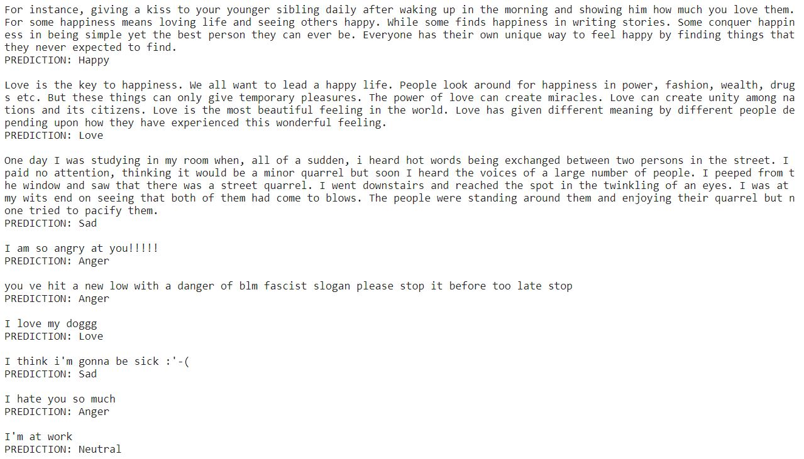

# Multi-Class Text Emotion Analysis
Text-Emotion-Analysis is a project to develop rule-based and deep learning algorithms with an aim to first appropriately detect the different types of emotions contained in a collection of English sentences or a large paragraph and then accurately predict the overall emotion of the paragraph. 

### I have two training and validation dataset:
1. [emotion_data.csv](cleaned_data/emotion_data.csv) in which basic pre-processing of tweets in done (no lemmatization, no removal of stopwords). 
This dataset is comprised of <b>55,774</b> tweets from Twitter with labelled emotions of five classes: <b>Neutral, Happy, Sad, Love, Anger</b>.

2. [emotion_data_prep.csv](cleaned_data/emotion_data_prep.csv) in which more deep pre-processing of tweets in done (lemmatization, removal of stopwords, etc). 
This dataset is comprised of <b>62,015</b> tweets from Twitter with labelled emotions of five classes: <b>Neutral, Happy, Sad, Love, Anger</b>.

## Comparison of DL and ML models:

### DL:
1. The <b>[DLModel](DLModel.ipynb)</b> using [emotion_data.csv](cleaned_data/emotion_data.csv) gave me <b>64.80%</b> accuracy.

#### Confusion Matrix:

2. The <b>[DLModel-Prep](DLModel-Prep.ipynb)</b> using [emotion_data_prep.csv](cleaned_data/emotion_data_prep.csv) gave me <b>63.47%</b> accuracy.

#### Confusion Matrix (Prep):

## Prediction of emotions from paragraphs and sentences (DL Model):

